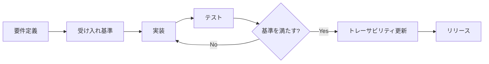

# Petatto-Kanban 仕様書（SDD）

| 項目 | 内容 |
|------|------|
| 文書種別 | Specification-Driven Development（SDD）索引 |
| 文書バージョン | 2.43.0 |
| 最終更新日 | 2026-08-13 |
| ステータス | Active |

---

## SDD とは

本プロジェクトでは **Specification-Driven Development（仕様駆動開発）** を採用する。

**仕様書が唯一の真実の源（Single Source of Truth）** となり、実装・テスト・リリース判断はすべて仕様に基づいて行う。

### SDD ワークフロー

1. **Specify** — 機能追加・変更は先に `docs/spec/` 配下の仕様を更新する
2. **Accept** — 各要件に受け入れ基準（Given / When / Then）を定義する
3. **Implement** — 仕様 ID を参照してコードを実装する
4. **Verify** — 受け入れ基準を満たすテストを追加し、トレーサビリティを更新する
5. **Release** — リリース計画のマイルストーンと要件ステータスを照合する

### 要件 ID の命名規則

| プレフィックス | 意味 | 例 |
|----------------|------|-----|
| `FR-` | Functional Requirement（機能要件） | `FR-003` |
| `NFR-` | Non-Functional Requirement（非機能要件） | `NFR-001` |
| `US-` | User Story（ユーザーストーリー） | `US-004` |
| `AC-` | Acceptance Criteria（受け入れ基準） | `AC-003-01` |
| `DC-` | Data Contract（データ契約） | `DC-001` |
| `UC-` | UI Contract（UI 契約） | `UC-002` |

### 要件ステータス

| ステータス | 意味 |
|------------|------|
| `draft` | 草案。議論・レビュー中 |
| `specified` | 受け入れ基準まで定義済み。実装待ち |
| `in_progress` | 実装中 |
| `implemented` | コード実装済み。検証待ち |
| `verified` | テストにより受け入れ基準を満たした |
| `deferred` | 将来フェーズに延期 |
| `cancelled` | スコープ外または廃止 |

---

## 仕様ドキュメント構成

| # | ドキュメント | 内容 |
|---|-------------|------|
| 1 | [01-vision-and-scope.md](./spec/01-vision-and-scope.md) | ビジョン、目的、スコープ |
| 2 | [02-glossary.md](./spec/02-glossary.md) | 用語集 |
| 3 | [03-functional-requirements.md](./spec/03-functional-requirements.md) | 機能要件一覧 |
| 4 | [04-non-functional-requirements.md](./spec/04-non-functional-requirements.md) | 非機能要件一覧 |
| 5 | [05-user-stories.md](./spec/05-user-stories.md) | ユーザーストーリー |
| 6 | [06-acceptance-criteria.md](./spec/06-acceptance-criteria.md) | 受け入れ基準（BDD シナリオ） |
| 7 | [07-data-contract.md](./spec/07-data-contract.md) | データモデル・永続化契約 |
| 8 | [08-ui-behavior-contract.md](./spec/08-ui-behavior-contract.md) | UI 操作契約 |
| 9 | [09-architecture.md](./spec/09-architecture.md) | アーキテクチャ・技術選定 |
| 10 | [10-traceability-matrix.md](./spec/10-traceability-matrix.md) | 要件トレーサビリティ |
| 11 | [11-release-plan.md](./spec/11-release-plan.md) | リリース計画・未決定事項 |
| 12 | [12-display-modes.md](./spec/12-display-modes.md) | **表示モード**（ウィンドウ / デスクトップ / オーバーレイ） |

### 関連ドキュメント

- [PYTHON_CODING_RULES.md](./PYTHON_CODING_RULES.md) — Python 実装規約

---

## プロジェクト概要（クイックリファレンス）

| 項目 | 内容 |
|------|------|
| プロジェクト名 | Petatto-Kanban / ペタッとカンバン |
| リポジトリ | https://github.com/suzuki-hidehito66/Petatto-Kanban |
| ライセンス | MIT License |
| 実装言語 | Python 3.11+ |
| **初期スコープ** | **単一ユーザーの独立したデスクトップアプリ（`.exe`）— M1 UI はオーバーレイモード** |
| プラットフォーム | **Windows 11 以降** |
| 現在のマイルストーン | [M1 MVP](./spec/11-release-plan.md#m1-mvp) |

### 初期スコープの要点

- **単一ユーザー** — 1 人・1 PC。アカウント・共同編集なし
- **独立アプリ** — サーバー・ブラウザ・常時ネットワーク不要
- **`.exe` 配布** — PyInstaller 単一実行ファイル
- **M1 UI** — オーバーレイモード（透過・最前面・自由配置カード・ドラッグ移動）
- **ローカルデータ** — `%USERPROFILE%\.petatto-kanban\board.json`, `settings.json`

詳細: [01-vision-and-scope.md](./spec/01-vision-and-scope.md#2-初期スコープm1-mvpの定義)

---

## 改訂履歴

| バージョン | 日付 | 変更内容 |
|------------|------|----------|
| 1.0.0 | 2026-08-12 | 初版（モノリシック仕様書） |
| 2.0.0 | 2026-08-12 | SDD 形式へリファクタリング（`docs/spec/` 分割） |
| 2.1.0 | 2026-08-12 | 初期スコープを「単一ユーザーの独立デスクトップアプリ（.exe）」と明確化 |
| 2.2.0 | 2026-08-12 | UI 表示モード 3 種（ウィンドウ / デスクトップ / オーバーレイ）を追加 |
| 2.3.0 | 2026-08-12 | ターゲット OS を Windows 11 以降に変更 |
| 2.4.0 | 2026-08-12 | M1 要件をデスクトップモードに変更 |
| 2.5.0 | 2026-08-12 | ヘッダー右上 × ボタンによる終了（FR-023）を追加 |
| 2.6.0 | 2026-08-12 | M1 既定をオーバーレイモードに変更。自由配置カード・ドラッグ・右クリック削除・削除確認設定 |
| 2.7.0 | 2026-08-12 | ディスプレイ選択を設定画面へ移動。右クリックはメニューなし即削除 |
| 2.7.1 | 2026-08-12 | カード削除トリガーを右クリック離し（ButtonRelease-3）に変更 |
| 2.8.0 | 2026-08-12 | 編集ボタン廃止。タイトルダブルクリックのインライン編集 |
| 2.9.0 | 2026-08-12 | カードの説明（description）フィールドを廃止。board.json schema v3 |
| 2.10.0 | 2026-08-12 | カード最小サイズ（タイトルより大きいバッファ）。タイトルもドラッグ・右クリック削除可能 |
| 2.11.0 | 2026-08-12 | カード追加を即時作成。初期タイトル `新しいタスク`、入力ダイアログ廃止 |
| 2.12.0 | 2026-08-12 | カードタイトルを枠線付き内側フレームで表示 |
| 2.13.0 | 2026-08-12 | カード追加をツールバー付近に配置。追加直後インライン編集を自動開始 |
| 2.14.0 | 2026-08-12 | カード進捗率（0〜100%・色グラデーション・ホイール ±10%）。board.json schema v4 |
| 2.15.0 | 2026-08-12 | カード期限（インラインカレンダー・当日黄/超過赤）。board.json schema v5 |
| 2.16.0 | 2026-08-12 | 進捗バーでもドラッグ・右クリック削除。カレンダー当日ボタンを緑色に |
| 2.17.0 | 2026-08-12 | タイトル編集中にタイトル以外クリックで編集確定 |
| 2.18.0 | 2026-08-12 | 期限編集中にパネル外クリックでキャンセル |
| 2.19.0 | 2026-08-12 | 期限編集開始を2回目の離しで反応（`<Double-Button-1>` 廃止） |
| 2.20.0 | 2026-08-12 | 仕様とコード同期。`card_ui` / `DueDatePickerHost` 抽出。インライン編集確定の修正 |
| 2.21.0 | 2026-08-12 | タイトル編集開始を2回目の離しで反応（`<Double-Button-1>` 廃止） |
| 2.22.0 | 2026-08-12 | ツールバーをメニューパネル（円形＜・ホバーで×/⚙・ドラッグ移動）に置換 |
| 2.22.1 | 2026-08-12 | メニューパネルホバー展開に **＋**（カード追加）ボタンを追加 |
| 2.22.2 | 2026-08-12 | メニューパネル左方向展開・フレーム背景透過 |
| 2.22.3 | 2026-08-12 | メニュー操作ボタン（＋・⚙・×）を円形 UI に統一 |
| 2.22.4 | 2026-08-12 | メニューボタンを `<ButtonRelease-1>`（離し）で反応するよう明記 |
| 2.22.5 | 2026-08-12 | メニュー展開フラッシュ修正・ボタン間白矩形廃止 |
| 2.23.0 | 2026-08-13 | メニューパネル仕様を UC-002 に集約同期。`menu_panel.py` リファクタ |
| 2.24.0 | 2026-08-13 | 新規カード配置をメニューパネル直下・右端揃えに変更（UC-004 / FR-003） |
| 2.25.0 | 2026-08-13 | UC-004 配置仕様の詳細化、`MenuPanelRect` / `new_card_placement` リファクタ |
| 2.26.0 | 2026-08-13 | 新規カード右端揃え修正（NE アンカー）。連続追加は左下オフセット |
| 2.27.0 | 2026-08-13 | 新規カード配置の縦余白縮小・左インデント追加 |
| 2.28.0 | 2026-08-13 | 新規カード左インデント 128px・画面外生成防止（クランプ） |
| 2.29.0 | 2026-08-13 | デスクトップモード（FR-019）。オーバーレイと同一 UI・設定で切替 |
| 2.30.0 | 2026-08-13 | デスクトップモード実装（`display/modes.py`、設定ダイアログ切替） |
| 2.31.0 | 2026-08-13 | 表示モード実装のリファクタ（`transparent` / `settings_dialog` / `mode_labels`） |
| 2.32.0 | 2026-08-13 | デスクトップモードでメニューパネルのみ常時最前面（DM-DESKTOP-01 / `menu_panel_host`） |
| 2.33.0 | 2026-08-13 | メニューアクティブ時にカード等を一時最前面（DM-DESKTOP-02） |
| 2.34.0 | 2026-08-13 | 他アプリアクティブ時に本体を即時背面復帰（DM-DESKTOP-03） |
| 2.35.0 | 2026-08-13 | デスクトップ Z オーダー制御を `desktop_board_controller.py` にリファクタ |
| 2.36.0 | 2026-08-13 | 設定ダイアログを「表示」「システム」タブに分割（UC-006） |
| 2.37.0 | 2026-08-13 | システムタブ: アプリ終了時の確認オプション（`confirm_exit` / FR-023） |
| 2.38.0 | 2026-08-13 | システムタブ: 「全てのカードを削除」ボタン（FR-005 / UC-006） |
| 2.39.0 | 2026-08-13 | 設定ダイアログ実装リファクタ（`settings_dialog_labels` / `settings_dialog_panels` / `settings_actions`） |
| 2.40.0 | 2026-08-13 | UI サイズ設定（FR-026 / UC-006 表示タブ / `ui_size`）仕様追加 |
| 2.41.0 | 2026-08-13 | FR-026 実装（`ui_scale` / `card_renderer` / `ui_chrome`） |
| 2.42.0 | 2026-08-13 | UI フォント設定（FR-027 / UC-006 表示タブ / `ui_font`）仕様追加 |
| 2.43.0 | 2026-08-13 | FR-027 実装（`ui_font` / `ui_metrics` / 設定ダイアログ / `app.py`） |
