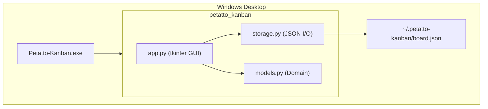

# 09 — アーキテクチャ

| 項目 | 内容 |
|------|------|
| ステータス | Active |
| ADR 形式 | 主要決定のみ記録 |

---

## 1. システム概要



---

## 2. 技術スタック（確定: M1）

| レイヤー | 技術 | 関連 NFR |
|----------|------|----------|
| 言語 | Python 3.11+ | — |
| GUI | tkinter | NFR-005 |
| 永続化 | JSON ファイル | NFR-003 |
| パッケージング | setuptools (`src` layout) | — |
| exe ビルド | PyInstaller | NFR-004 |
| テスト | pytest | NFR-007 |
| Lint | Ruff | NFR-006 |

コーディング規約: [PYTHON_CODING_RULES.md](../PYTHON_CODING_RULES.md)

---

## 3. ディレクトリ構成

```
petatto-kanban/
├── docs/
│   ├── SPECIFICATION.md          # SDD 索引
│   ├── PYTHON_CODING_RULES.md
│   └── spec/                     # SDD 仕様モジュール
│       ├── 01-vision-and-scope.md
│       ├── ...
│       └── 11-release-plan.md
├── src/petatto_kanban/
│   ├── __init__.py
│   ├── __main__.py               # エントリポイント
│   ├── app.py                    # GUI（プレゼンテーション）
│   ├── models.py                 # ドメインモデル
│   └── storage.py                # 永続化（インフラ）
├── tests/
├── scripts/
│   ├── build_exe.bat
│   └── build_exe.ps1
├── petatto-kanban.spec           # PyInstaller
├── pyproject.toml
└── .github/workflows/build-windows.yml
```

### レイヤー責務

| モジュール | 責務 | 依存 |
|------------|------|------|
| `models.py` | ドメインエンティティ、不変条件 | 標準ライブラリのみ |
| `storage.py` | JSON シリアライズ / デシリアライズ | `models` |
| `app.py` | UI 描画、ユーザー操作、永続化トリガ | `models`, `storage` |

---

## 4. アーキテクチャ決定記録（ADR）

### ADR-001: Python + tkinter 採用

| 項目 | 内容 |
|------|------|
| ステータス | Accepted |
| 日付 | 2026-08-12 |
| コンテキスト | Windows デスクトップ MVP、exe 配布、依存最小化 |
| 決定 | Python 3.11+ と tkinter を採用 |
| 理由 | 標準ライブラリのみで GUI 実現、PyInstaller 実績 |
| トレードオフ | DnD・モダン UI は制約あり（M2 で再評価） |

### ADR-002: JSON ファイル永続化

| 項目 | 内容 |
|------|------|
| ステータス | Accepted |
| 日付 | 2026-08-12 |
| コンテキスト | MVP はローカル完結、ネットワーク不要 |
| 決定 | `%USERPROFILE%\.petatto-kanban\board.json` |
| 理由 | シンプル、デバッグ容易、ポータブル |
| トレードオフ | 大量データ・同時編集には不向き |

### ADR-003: SDD 形式の仕様管理

| 項目 | 内容 |
|------|------|
| ステータス | Accepted |
| 日付 | 2026-08-12 |
| コンテキスト | 仕様と実装の乖離防止 |
| 決定 | `docs/spec/` にモジュール分割し SDD を採用 |
| 理由 | 要件 ID・受け入れ基準・トレーサビリティの明示 |
| トレードオフ | ドキュメント更新コスト増 |

---

## 5. ビルド・配布

| 段階 | コマンド | 成果物 |
|------|----------|--------|
| 開発起動 | `python -m petatto_kanban` | — |
| テスト | `python -m pytest` | — |
| Lint | `python -m ruff check src tests` | — |
| exe ビルド | `scripts\build_exe.bat` | `dist/Petatto-Kanban.exe` |
| CI | GitHub Actions (`windows-latest`) | Artifact: `.exe` |

---

## 6. 将来アーキテクチャ（M3 草案）

| 要素 | 候補 |
|------|------|
| 同期 | REST API + PostgreSQL / Supabase |
| 認証 | OAuth / メール+パスワード |
| 設定 | SQLite への移行検討 |

M3 着手時に ADR を追加する。
