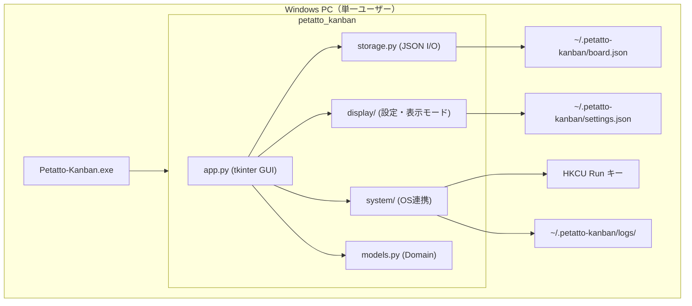

# 09 — アーキテクチャ

| 項目 | 内容 |
|------|------|
| ステータス | Active |
| ADR 形式 | 主要決定のみ記録 |

---

## 1. システム概要

**アーキテクチャ方針（M1）:** 単一ユーザーの独立したデスクトップアプリケーション。  
クライアント（`.exe`）とローカルファイル（JSON・エラーログ）で構成し、サーバー層は存在しない。



---

## 2. 技術スタック（確定: M1）

| レイヤー | 技術 | 関連 NFR |
|----------|------|----------|
| 言語 | Python 3.11+ | — |
| GUI | tkinter | NFR-005 |
| 永続化 | JSON ファイル | NFR-003 |
| パッケージング | setuptools (`src` layout) | — |
| exe ビルド | PyInstaller | NFR-004 |
| テスト | pytest | NFR-007 |
| Lint | Ruff | NFR-006 |

コーディング規約: [PYTHON_CODING_RULES.md](../PYTHON_CODING_RULES.md)

---

## 3. ディレクトリ構成

```
petatto-kanban/
├── docs/
│   ├── SPECIFICATION.md          # SDD 索引
│   ├── PYTHON_CODING_RULES.md
│   └── spec/                     # SDD 仕様モジュール
│       ├── 01-vision-and-scope.md
│       ├── ...
│       └── 11-release-plan.md
├── src/petatto_kanban/
│   ├── __init__.py
│   ├── __main__.py               # エントリポイント
│   ├── app.py                    # GUI（プレゼンテーション）
│   ├── card_ui.py                # カードウィジェット参照・クリック判定
│   ├── due_date.py               # 期限表示・状態
│   ├── due_date_calendar.py      # カレンダー日付セルの配色・枠ジオメトリ
│   ├── due_date_picker.py        # フロートカレンダー UI / ホスト
│   ├── menu_panel.py             # メニューパネル UI
│   ├── menu_panel_layout.py      # メニューパネル座標・ヒット判定
│   ├── new_card_placement.py     # 新規カード初期配置（tkinter 非依存）
│   ├── progress.py               # 進捗率ユーティリティ
│   ├── display/                  # 表示モード・モニター
│   │   ├── transparent.py        # 透過色・全画面シェル
│   │   ├── overlay.py            # オーバーレイ（最前面）
│   │   ├── desktop.py            # デスクトップ（本体背面）
│   │   ├── menu_panel_host.py    # メニューパネル透過 Toplevel（デスクトップ時最前面）
│   │   ├── desktop_board_controller.py  # 本体 Z オーダー昇格・降格
│   │   ├── foreground.py         # 他アプリ前面判定
│   │   ├── modes.py              # モード適用ディスパッチ
│   │   ├── mode_labels.py        # 設定 UI ラベル
│   │   ├── settings_dialog.py    # UC-006 設定ダイアログ（タブ UI シェル）
│   │   ├── settings_dialog_tabs.py  # タブ定義（表示 / テーマ / システム）
│   │   ├── settings_dialog_labels.py  # 設定 UI 文言（tkinter 非依存）
│   │   ├── settings_dialog_panels.py  # 各タブのウィジェット構築
│   │   ├── settings_actions.py   # 設定適用・終了確認・全カード削除
│   │   ├── ui_scale.py           # UI サイズプリセット・スケール係数（FR-026）
│   │   ├── ui_scale_labels.py    # UI サイズ UI ラベル
│   │   ├── card_layout.py        # カード基準寸法・黄金比（UC-003 / UC-009）
│   │   ├── card_frame.py         # カード枠サイズ（幅固定・高さは内容に合わせる）
│   │   ├── ui_metrics.py         # UiMetrics 合成（FR-026 + FR-027）
│   │   ├── ui_font.py              # UI フォントプリセット（FR-027）
│   │   ├── ui_font_labels.py       # UI フォント UI ラベル
│   │   ├── ui_theme.py             # UI カラーテーマ型・解決（FR-028）
│   │   ├── ui_theme_palettes.py    # 10 種パレット定義
│   │   ├── ui_theme_labels.py      # UI カラーテーマ UI ラベル
│   │   ├── ui_chrome.py          # メニュー・期限パネルホスト再構築
│   │   ├── settings.py           # settings.json
│   │   └── monitors.py           # モニター列挙
│   ├── card_renderer.py          # カード UI 描画（UiMetrics）
│   ├── system/
│   │   ├── auto_start.py         # Windows Run キー（FR-029）
│   │   ├── launch_command.py     # ログオン時コマンド行の解決
│   │   ├── shortcut.py           # ショートカットコード正規化（FR-030）
│   │   ├── hotkey.py             # ホットキーセッション（poll / 失敗時ロールバック）
│   │   ├── hotkey_pump.py        # Win32 専用スレッドで WM_HOTKEY を受信
│   │   ├── error_log_paths.py    # ログディレクトリ・日次ファイル名・保持期限
│   │   ├── error_log_redact.py   # ホームパスの伏せ字
│   │   └── error_log.py          # エラーログ初期化・例外フック（FR-031）
│   ├── models.py                 # ドメインモデル
│   └── storage.py                # 永続化（インフラ）
├── tests/
├── scripts/
│   ├── build_exe.bat
│   └── build_exe.ps1
├── petatto-kanban.spec           # PyInstaller
├── pyproject.toml
└── .github/workflows/build-windows.yml
```

### レイヤー責務

| モジュール | 責務 | 依存 |
|------------|------|------|
| `models.py` | ドメインエンティティ、不変条件 | 標準ライブラリのみ |
| `storage.py` | JSON シリアライズ / デシリアライズ | `models` |
| `app.py` | UI 描画、ユーザー操作、永続化トリガ | `models`, `storage`, `card_ui`, `due_date*`, `progress`, `display`, `menu_panel`, `new_card_placement`, `system/auto_start`, `system/hotkey`, `system/error_log` |
| `display/transparent.py` | 透過色・全画面シェル（オーバーレイ/デスクトップ共通） | 標準ライブラリ + tkinter |
| `display/modes.py` | 表示モード適用のディスパッチ | `overlay`, `desktop`, `settings` |
| `display/menu_panel_host.py` | メニューパネル専用透過 Toplevel（デスクトップ時 `-topmost`） | tkinter, `transparent`, `settings` |
| `display/desktop_board_controller.py` | DM-DESKTOP-02/03 本体 Z オーダー制御 | tkinter, `desktop`, `foreground`, `menu_panel_host` |
| `display/foreground.py` | 前面ウィンドウのプロセス判定 | `transparent`, Windows API |
| `display/settings_dialog.py` | UC-006 設定ダイアログ（`ttk.Notebook` シェル・確定値組み立て） | tkinter, `mode_labels`, `settings_dialog_tabs`, `settings_dialog_labels`, `settings_dialog_panels`, `settings`, `monitors`, `system/shortcut` |
| `display/settings_dialog_tabs.py` | タブラベル・タブ別項目定義 | 標準ライブラリのみ |
| `display/settings_dialog_labels.py` | 設定ダイアログ UI 文言 | 標準ライブラリのみ |
| `display/settings_dialog_panels.py` | 表示 / テーマ / 操作 / システムタブのウィジェット構築 | tkinter, `mode_labels`, `settings_dialog_labels`, `monitors`, `system/shortcut` |
| `display/settings_actions.py` | 設定適用・終了確認・全カード削除・自動起動/ホットキー反映と失敗時ロールバック（`app.py` から利用） | `settings`, `settings_dialog`, `settings_dialog_labels`, `storage`, `system/auto_start`, `system/shortcut` |
| `display/ui_scale.py` | UI サイズプリセット・スケール係数（FR-026） | 標準ライブラリのみ |
| `display/ui_scale_labels.py` | UI サイズコンボボックス用ラベル | 標準ライブラリのみ |
| `display/card_layout.py` | カード基準寸法・黄金比・スケール（UC-003 / UC-009） | 標準ライブラリのみ |
| `display/card_frame.py` | カード枠サイズ（幅固定、高さは内容に合わせて下限以上）（FR-002 / UC-003） | 標準ライブラリのみ |
| `display/ui_metrics.py` | `UiMetrics` 生成（ui_size + ui_font + card_layout 合成） | `ui_scale`, `ui_font`, `card_layout` |
| `card_renderer.py` | カード UI 描画（UiMetrics + UiThemePalette）。枠サイズは `card_frame` | tkinter, `ui_metrics`, `ui_theme`, `card_frame`, `due_date`, `progress` |
| `display/ui_chrome.py` | メニューパネル・期限パネルホストの再構築 | tkinter, `ui_metrics`, `ui_theme`, `menu_panel`, `due_date_picker` |
| `display/ui_font.py` | UI フォントプリセット・tkinter ファミリー解決（FR-027） | 標準ライブラリのみ |
| `display/ui_font_labels.py` | UI フォントコンボボックス用ラベル | 標準ライブラリのみ |
| `system/auto_start.py` | Windows Run キーの登録・削除（FR-029） | 標準ライブラリ（`winreg`）、`launch_command` |
| `system/launch_command.py` | ログオン時コマンド行の解決（frozen / pythonw） | 標準ライブラリのみ |
| `system/shortcut.py` | ショートカットコードの解析・正規化（FR-030） | 標準ライブラリのみ |
| `system/hotkey.py` | グローバルホットキーのセッション（FR-030）。割り当て・`poll()`・失敗時ロールバック | `shortcut`, `hotkey_pump` |
| `system/hotkey_pump.py` | Win32 メッセージポンプ。専用スレッドのメッセージ専用ウィンドウで `GetMessage`（Python WndProc なし） | 標準ライブラリ（`ctypes` / `threading`）。未捕捉例外は `petatto_kanban` ロガーへ |
| `system/error_log_paths.py` | ログディレクトリ・日次ファイル名・保持期限（FR-031） | 標準ライブラリのみ |
| `system/error_log_redact.py` | ホームパスの伏せ字（FR-031） | 標準ライブラリのみ |
| `system/error_log.py` | エラーログ初期化・日次ハンドラ・例外フック（FR-031） | `error_log_paths`, `error_log_redact`, `logging` |
| `display/ui_theme.py` | UI カラーテーマ型・トークン解決（FR-028） | `ui_theme_palettes` |
| `display/ui_theme_palettes.py` | 10 種パレット定義（UC-011） | `ui_theme`（型） |
| `display/ui_theme_labels.py` | UI カラーテーマコンボボックス用ラベル | 標準ライブラリのみ |
| `display/mode_labels.py` | 表示モード UI ラベル | `settings` |
| `menu_panel.py` | メニューパネル UI（円形・NE アンカー・ホバー展開） | tkinter, `menu_panel_layout` |
| `menu_panel_layout.py` | メニューパネル座標・ヒット判定、`MenuPanelRect` | 標準ライブラリのみ |
| `new_card_placement.py` | 新規カード初期配置座標（UC-004 / FR-003） | `menu_panel_layout` |
| `card_ui.py` | カード UI 参照、二回離しクリック判定 | tkinter |
| `due_date.py` | カード期限の表示文字列・状態色（当日/超過はパレット） | 標準ライブラリ、`ui_theme` |
| `due_date_calendar.py` | カレンダー日付ボタンの通常/当日/ホバー色とセル枠ジオメトリ | 標準ライブラリ、`ui_theme`（通常日・当日ともパレット） |
| `due_date_picker.py` | フロート期限パネル配置・外側クリック・日付グリッド | `due_date`, `due_date_calendar`, `card_ui`, `ui_theme` |

---

## 4. アーキテクチャ決定記録（ADR）

### ADR-001: Python + tkinter 採用

| 項目 | 内容 |
|------|------|
| ステータス | Accepted |
| 日付 | 2026-08-12 |
| コンテキスト | Windows 11 以降のデスクトップ MVP、exe 配布、依存最小化 |
| 決定 | Python 3.11+ と tkinter を採用 |
| 理由 | 標準ライブラリのみで GUI 実現、PyInstaller 実績 |
| トレードオフ | DnD・モダン UI は制約あり（M2 で再評価） |

### ADR-002: JSON ファイル永続化

| 項目 | 内容 |
|------|------|
| ステータス | Accepted |
| 日付 | 2026-08-12 |
| コンテキスト | MVP はローカル完結、ネットワーク不要 |
| 決定 | `%USERPROFILE%\.petatto-kanban\board.json` |
| 理由 | シンプル、デバッグ容易、ポータブル |
| トレードオフ | 大量データ・同時編集には不向き |

### ADR-003: SDD 形式の仕様管理

| 項目 | 内容 |
|------|------|
| ステータス | Accepted |
| 日付 | 2026-08-12 |
| コンテキスト | 仕様と実装の乖離防止 |
| 決定 | `docs/spec/` にモジュール分割し SDD を採用 |
| 理由 | 要件 ID・受け入れ基準・トレーサビリティの明示 |
| トレードオフ | ドキュメント更新コスト増 |

### ADR-004: 単一ユーザー独立デスクトップアプリ（初期スコープ）

| 項目 | 内容 |
|------|------|
| ステータス | Accepted |
| 日付 | 2026-08-12 |
| コンテキスト | プロダクトの初期スコープを明確化 |
| 決定 | M1 MVP は **単一ユーザーの独立した `.exe` デスクトップアプリ** とする |
| 理由 | 開発範囲の限定、オフライン利用、配布の簡素化 |
| トレードオフ | チーム利用・同期は M3 まで提供しない |
| 関連 | NFR-008, [01-vision-and-scope.md §2](./01-vision-and-scope.md#2-初期スコープm1-mvpの定義) |

### ADR-005: Windows 11 以降をサポート対象とする

| 項目 | 内容 |
|------|------|
| ステータス | Accepted |
| 日付 | 2026-08-12 |
| コンテキスト | 表示モード・DWM / Win32 API の前提 OS を明確化 |
| 決定 | **サポート対象 OS は Windows 11 以降** とする |
| 理由 | 透過ウィンドウ・マルチディスプレイ・最新 DWM の動作を保証しやすい |
| トレードオフ | Windows 10 ユーザーは非サポート |
| 関連 | NFR-011 |

### ADR-006: ログオン時自動起動は HKCU Run キー

| 項目 | 内容 |
|------|------|
| ステータス | Accepted |
| 日付 | 2026-08-14 |
| コンテキスト | Windows ログオン後にアプリを自動起動したい（FR-029）。管理者権限やタスク スケジューラは避けたい |
| 決定 | 現在ユーザーの `HKCU\...\Run` に値名 `Petatto-Kanban` を登録する。コマンド行解決は `launch_command.py` に分離 |
| 理由 | 管理者権限不要、アンインストール時は設定 OFF で削除可能、デスクトップアプリの一般的な方式 |
| トレードオフ | グループ ポリシーで Run キーが制限される環境では無効。タスク スケジューラより遅延起動の制御は弱い |
| 関連 | FR-029, NFR-008 |

### ADR-007: 新規カードショートカットはグローバルホットキー

| 項目 | 内容 |
|------|------|
| ステータス | Accepted |
| 日付 | 2026-08-14 |
| コンテキスト | 既定 UI はオーバーレイ（クリック透過）。tkinter のウィンドウバインドでは他アプリ前面時にキーを受け取れない |
| 決定 | Win32 `RegisterHotKey` による **グローバルホットキー** とする。受信は Tk ウィンドウの subclass でも Python ctypes WndProc でもなく、**専用スレッド** のメッセージ専用ウィンドウ（ネイティブ `DefWindowProc`）+ `GetMessage`。Tk は `after` でキューを読む。既定は Ctrl+Shift+N。割り当ては設定「操作」タブで変更。コード正規化は `shortcut.py`、セッションは `hotkey.py`、Win32 ポンプは `hotkey_pump.py` に分離 |
| 理由 | メニューパネルを開かず、他作業中にカードを切れる。オーバーレイの操作モデルと一致する。Python ctypes WndProc を Tk のメッセージポンプから呼ぶと Python 3.14 で GIL fatal になるため、受信は専用スレッドに隔離する |
| トレードオフ | 他アプリが同一ホットキーを先に登録していると失敗する。設定ダイアログ表示中は発火を抑制する |
| 関連 | FR-030, UC-012, NFR-011 |

### ADR-008: エラーはローカルログのみ（GitHub 自動起票はしない）

| 項目 | 内容 |
|------|------|
| ステータス | Accepted |
| 日付 | 2026-08-14 |
| コンテキスト | クラッシュ原因の収集が必要。GitHub REST API で Issue を作るにはトークンが必要で、Issues を全員に許可しても同じ。NFR-008 / C-5 はオフライン独立アプリを要求する |
| 決定 | エラーは常に `%USERPROFILE%\.petatto-kanban\logs\` へ `logging` で出す（FR-031）。アプリからの GitHub Issue 自動起票は行わない（FR-032 cancelled） |
| 理由 | 診断はオフラインで完結する。PAT を利用者に求めたり exe に埋め込んだりしない |
| トレードオフ | メンテナへは利用者がログを手動で渡す必要がある |
| 関連 | FR-031, FR-032, NFR-008, DC-004 |

---

## 5. ビルド・配布

| 段階 | コマンド | 成果物 |
|------|----------|--------|
| 開発起動 | `python -m petatto_kanban` | — |
| テスト | `python -m pytest` | — |
| Lint | `python -m ruff check src tests` | — |
| exe ビルド | `scripts\build_exe.bat` | `dist/Petatto-Kanban.exe` |
| CI | GitHub Actions (`windows-latest`) | GitHub Release: `.exe` |

---

## 6. 将来アーキテクチャ（M3 草案）

| 要素 | 候補 |
|------|------|
| 同期 | REST API + PostgreSQL / Supabase |
| 認証 | OAuth / メール+パスワード |
| 設定 | SQLite への移行検討 |

M3 着手時に ADR を追加する。

---

## 7. 表示モード実装方針

| 属性 | 値 |
|------|-----|
| 関連 FR | FR-018〜022 |
| 詳細仕様 | [12-display-modes.md](../spec/12-display-modes.md) |
| マイルストーン | M1（オーバーレイ・**デスクトップ**）/ M2（ウィンドウ・3 列切替） |

### Windows API 要件

| モード | 主要 API / 属性 |
|--------|----------------|
| ウィンドウ | 標準 `tk.Tk()`、`minsize` |
| デスクトップ | 本体: 全画面 geometry、`-transparentcolor`、`HWND_BOTTOM`。メニュー: 独立 Toplevel + `-topmost` |
| オーバーレイ | 全画面 geometry、Layered Window、`-topmost` / `WS_EX_TOPMOST`、クリック透過 |

### モジュール分割（現行）

| モジュール | 責務 |
|------------|------|
| `display/modes.py` | モード適用のディスパッチ |
| `display/overlay.py` / `desktop.py` | 各モードのシェル |
| `display/transparent.py` | 透過色・全画面 |
| `display/monitors.py` | モニター列挙 |
| `display/desktop_board_controller.py` | デスクトップ時の Z オーダー |
| `app.py` | モード切替 UI、カンバン描画 |

### 技術的制約

- **対応 OS: Windows 11 以降**（Win32 / DWM API を前提）
- tkinter 単体では Z オーダー制御・クリック透過が不足するため、M2 では `ctypes` + Win32 API または `pywin32` の導入を検討
- マルチディスプレイ座標は `EnumDisplayMonitors` で取得
- NFR-008（ネットワーク不要）を維持 — 表示モード実装もローカル API のみ
