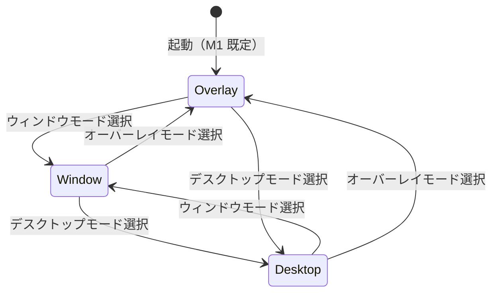

# 12 — 表示モード（Display Modes）

| 項目 | 内容 |
|------|------|
| ステータス | Active |
| 関連 FR | FR-018, FR-019, FR-020, FR-021 |
| プラットフォーム | **Windows 11 以降**（マルチディスプレイ） |

---

## 1. 概要

Petatto-Kanban の UI は **3 種類の表示モード** を提供する。  
いずれも単一ユーザーの独立デスクトップアプリ（`.exe`）上で動作し、カンバン本体（列・カード UI）は共通である。

| モード | ID | 概要 | マイルストーン |
|--------|-----|------|----------------|
| ウィンドウモード | `window` | 通常のウィンドウ表示 | M2 |
| デスクトップモード | `desktop` | 指定ディスプレイ全画面・透過・**カード等は他ウィンドウより背面**・**メニューパネルは常に最前面** | **M1 拡張（実装済み）** |
| オーバーレイモード | `overlay` | 指定ディスプレイ全画面・透過・**最前面** | **M1（既定・実装済み）** |

---

## 2. モード比較

| 属性 | ウィンドウモード | デスクトップモード | オーバーレイモード |
|------|------------------|------------------|-------------------|
| ウィンドウ装飾 | あり（タイトルバー等） | なし（フルスクリーン） | なし（フルスクリーン） |
| 対象ディスプレイ | ユーザーが配置 | **指定ディスプレイ** | **指定ディスプレイ** |
| 表示領域 | リサイズ可能 | ディスプレイ全体 | ディスプレイ全体 |
| 背景透過 | なし（不透明） | **あり** | **あり** |
| 透過時に見えるもの | — | **デスクトップ（壁紙・アイコン）** | **他アプリのウィンドウ** |
| Z オーダー | 通常 | **カード等は他ウィンドウの背面**（**メニューパネルのみ最前面**） | **最前面（常に上）** |
| 操作対象 | カンバン UI | カード（露出時）・**メニューパネル（常時）** | カンバン UI |

### オーバーレイとデスクトップの共通点（重要）

デスクトップモードは **オーバーレイモードをベース** とし、UI・操作・永続化は同一とする。

| 共通項目 | 仕様 |
|----------|------|
| 表示領域 | 指定ディスプレイの全画面（`geometry` 同一） |
| ウィンドウ装飾 | なし（フルスクリーン） |
| 背景透過 | カード・メニューパネル以外は透過（`TRANSPARENT_COLOR`） |
| クリック透過 | 透過領域は下層へクリックを通す（DM-COMMON-02） |
| カンバン UI | 自由配置カード、メニューパネル、設定ダイアログ等は同一 |
| ディスプレイ指定 | 設定ダイアログのコンボボックス（DM-COMMON-01） |

**Z オーダーの差分** は §5・§6 参照。デスクトップモードでは **メニューパネルだけ** 他アプリより前面に固定する（DM-DESKTOP-01）。

### Z オーダー（前面から背面）

```
[ 最前面 ]  Petatto-Kanban メニューパネル（デスクトップモード時のみ独立最前面）
            ブラウザ・エクスプローラー等の通常ウィンドウ
[ 中間   ]  Petatto-Kanban 本体（カード等。オーバーレイ時は全体が最前面）
[ 最背面 ]  Windows デスクトップ（壁紙・アイコン）
```

| モード | Petatto-Kanban の位置 |
|--------|------------------------|
| オーバーレイ | **通常ウィンドウより前面**（Always on Top） |
| デスクトップ | **カード等は通常ウィンドウより背面**。**メニューパネルは通常ウィンドウより前面** |

デスクトップモードのイメージ: **デスクトップ → ペタッとカンバン（カード）→ 他のウィンドウ → メニューパネル**（下から上。メニューは常に操作可能）。

### 透過の意味（重要）

| モード | 透過領域の挙動 |
|--------|----------------|
| デスクトップモード | カンバン UI 以外の領域は透明。**デスクトップが見え、カード等は他ウィンドウより背面**。メニューパネルは独立最前面 |
| オーバーレイモード | カンバン UI 以外の領域は透明。**下にある他ウィンドウが見え、常に最前面**に表示される |

---

## 3. 共通仕様

### DM-COMMON-01: ディスプレイ指定

| 属性 | 値 |
|------|-----|
| 関連 FR | FR-021 |
| 適用 | デスクトップモード、オーバーレイモード |

- ユーザーは **表示先ディスプレイを 1 つ指定** できる
- 選択肢は OS が認識するモニター一覧（例: `ディスプレイ 1`, `ディスプレイ 2`）
- 指定ディスプレイの **作業領域全体** を使用する（タスクバー除外は OS 設定に従う）
- 指定はセッション内で保持し、次回起動時に復元する（[DC-003](./07-data-contract.md#dc-003-表示設定スキーマ)）
- **M1: 設定ダイアログのコンボボックス** から選択する（メニューパネルには置かない）

### DM-COMMON-02: 透過レンダリング

| 属性 | 値 |
|------|-----|
| 適用 | デスクトップモード、オーバーレイモード |

- **カンバン UI 要素**（列フレーム、カード、ボタン、ヘッダー）は不透明で操作可能
- **それ以外のウィンドウ領域**は完全透過とし、マウスクリックは下層へ透過する（click-through）
- 透過色・レイヤードウィンドウは Windows API で実現（[09-architecture.md §4](./09-architecture.md#4-表示モード実装方針)）

### DM-COMMON-02b: 実装モジュール

| モジュール | 責務 |
|------------|------|
| `display/transparent.py` | `TRANSPARENT_COLOR`、全画面シェル、Windows 透過設定 |
| `display/overlay.py` | オーバーレイ（`-topmost`） |
| `display/desktop.py` | 本体ウィンドウ（`-topmost` 解除 + `HWND_BOTTOM`） |
| `display/menu_panel_host.py` | メニューパネル専用透過 Toplevel（デスクトップ時 `-topmost`） |
| `display/desktop_board_controller.py` | 本体 Z オーダー昇格・降格（DM-DESKTOP-02 / 03） |
| `display/foreground.py` | 他アプリ前面判定（`GetForegroundWindow`） |
| `display/modes.py` | `DisplayMode` → 適用関数ディスパッチ |
| `display/mode_labels.py` | 設定 UI ラベル（tkinter 非依存） |
| `display/settings_dialog.py` | UC-006 設定ダイアログ（タブ UI シェル） |
| `display/settings_dialog_tabs.py` | タブ定義（表示 / システム） |
| `display/settings_dialog_labels.py` | 設定 UI 文言（tkinter 非依存） |
| `display/settings_dialog_panels.py` | 各タブのウィジェット構築 |
| `display/settings_actions.py` | 設定適用・終了確認・全カード削除 |

### DM-COMMON-03: モード切替（M1 拡張）

| 属性 | 値 |
|------|-----|
| 関連 FR | FR-022 |
| 関連 UC | UC-006（設定ダイアログ） |

- **設定ダイアログ** から **オーバーレイモード** と **デスクトップモード** を切り替える
- 切替確定（OK）後、指定ディスプレイ上で表示モードを即時反映する
- ボードデータ・カード位置・メニューパネル位置は保持する
- 選択は `settings.json` の `mode`（`"overlay"` \| `"desktop"`）に永続化し、次回起動時に復元する
- **ウィンドウモード** への切替 UI は M2 で提供（本項の対象外）

### DM-COMMON-04: ウィンドウモード切替（M2）

| 属性 | 値 |
|------|-----|
| 関連 FR | FR-022 |

- ヘッダーまたは設定 UI から 3 モード（ウィンドウ / デスクトップ / オーバーレイ）を切り替え可能（M2）
- ウィンドウモードへ戻る際、直前のウィンドウサイズ・位置を可能な限り復元する

---

## 4. ウィンドウモード（Window Mode）

### UC-DM-001

| 属性 | 値 |
|------|-----|
| モード ID | `window` |
| 関連 FR | FR-018 |
| ステータス | verified（M2 予定） |
| 実装 | （M2） |

| 要素 | 仕様 |
|------|------|
| ウィンドウ種別 | 通常の OS ウィンドウ（タイトルバー・枠あり） |
| タイトル | `Petatto-Kanban` |
| 最小サイズ | 960 × 540 px |
| リサイズ | 可能 |
| 背景 | 不透明 |
| Z オーダー | 通常（ユーザーが前面／背面を操作） |
| マルチディスプレイ | ユーザーがウィンドウをドラッグして配置 |

```
┌─ Petatto-Kanban ──────────────────── □ × ┐
│  Header                          [保存]  │
├──────────┬──────────┬────────────────────┤
│  To Do   │ Progress │ Done               │
│  ...     │  ...     │ ...                │
└──────────┴──────────┴────────────────────┘
  ↑ 通常ウィンドウ（不透明・リサイズ可）
```

---

## 5. デスクトップモード（Desktop Mode）

### UC-DM-002

| 属性 | 値 |
|------|-----|
| モード ID | `desktop` |
| 関連 FR | FR-019, FR-020, FR-021, FR-022 |
| ステータス | **implemented**（M1 拡張） |
| 実装 | `src/petatto_kanban/display/desktop.py`, `display/transparent.py`, `display/modes.py`, `display/menu_panel_host.py` |

| 要素 | 仕様 |
|------|------|
| ベース | **オーバーレイモードと同一**（§「オーバーレイとデスクトップの共通点」） |
| 表示領域 | 指定ディスプレイの全画面 |
| ウィンドウ装飾 | なし |
| 背景 | **透過** — 透過領域から **デスクトップ（壁紙・アイコン）** が見える |
| Z オーダー（本体） | **デスクトップの直上・通常ウィンドウ（ブラウザ等）の直下**（`HWND_BOTTOM` 等） |
| Z オーダー（メニューパネル） | **通常ウィンドウより前面**（独立 Toplevel + `-topmost`、DM-DESKTOP-01） |
| Z オーダー（本体・カード） | **既定は通常ウィンドウより背面**。メニューアクティブ時は一時的に最前面（DM-DESKTOP-02） |
| 入力 | メニューパネルは常時ヒット。カードは本体が前面の間、または露出時にヒット |
| 切替 | 設定ダイアログでオーバーレイモードと相互切替 |

### DM-DESKTOP-01: メニューパネル最前面

| 属性 | 値 |
|------|-----|
| 関連 FR | FR-019 |
| 関連 UC | UC-002, UC-DM-002 |
| 実装 | `display/menu_panel_host.py`, `menu_panel.py`, `app.py` |

- デスクトップモードでは **メニューパネル（＋・⚙・×・`<`）だけ** 他アプリより前面に表示する
- 本体（カード・透過シェル）は従来どおり **通常ウィンドウより背面**
- メニューパネルは **透過 Toplevel** 上に配置し、`-topmost` / 透過色を本体と同様に適用する
- ホバー展開・ドラッグ・永続化（`menu_panel_x/y`）はオーバーレイ時と同一

```
[ ユーザーから見た重なり（手前 → 奥） ]

  メニューパネル（＋・⚙・×・<）  ← 常に最前面（デスクトップモード）
  ─────────────────
  ブラウザ / Excel 等           ← 通常ウィンドウ
  ─────────────────
  Petatto-Kanban（カード等）     ← デスクトップモード本体
  ─────────────────
  デスクトップ壁紙               ← Windows デスクトップ（最背面）
```

**ユースケース**  
デスクトップに常駐するカンバン付箋のように、ブラウザ等の作業ウィンドウの **後ろ** にカードを置きつつ、**＋・設定・終了** はいつでも操作できる。

### DM-DESKTOP-02: メニューアクティブ時のカード最前面

| 属性 | 値 |
|------|-----|
| 関連 FR | FR-019 |
| 関連 UC | UC-002, UC-DM-002 |
| 実装 | `display/desktop.py`, `display/desktop_board_controller.py`, `display/foreground.py`, `menu_panel.py`, `app.py` |

- **アクティブ** = メニューパネルへホバー、フォーカス、または `<` / 操作ボタンの押下
- アクティブ中は **本体ウィンドウ（全カード含む）** を一時的に `-topmost` とし、通常ウィンドウより前面に出す
- メニューパネル Toplevel は引き続き本体より前面（`menu_panel_host.lift()`）
- **非アクティブ** = メニューからポインタが離れ展開が収納された後、一定時間（1.5s）操作がなければ `HWND_BOTTOM` 相当で背面へ復帰
- **他アプリがアクティブ** = 前面ウィンドウが自プロセス外に変わった瞬間、待機時間なしで背面へ復帰（DM-DESKTOP-03）
- カード上にポインタが入った間、またはインライン編集・期限ピッカー・モーダル表示中は背面復帰を延期する

```
[ 非アクティブ（既定） ]

  メニューパネル → 通常ウィンドウ → カード等（本体）→ 壁紙

[ アクティブ（メニュー操作中） ]

  メニューパネル → カード等（本体）→ 通常ウィンドウ → 壁紙
```

### DM-DESKTOP-03: 他アプリアクティブ時の即時背面復帰

| 属性 | 値 |
|------|-----|
| 関連 FR | FR-019 |
| 関連 UC | UC-DM-002 |
| 実装 | `display/foreground.py`, `display/desktop_board_controller.py`, `app.py` |

- デスクトップモードで **他アプリケーションのウィンドウが前面** になったら、昇格中の本体（カード等）を **待機なし** で背面 Z オーダーへ戻す
- 判定は Windows の `GetForegroundWindow` と自プロセス ID 比較（約 300ms 間隔のポーリング + `FocusOut` 補完）
- メニューパネル Toplevel は DM-DESKTOP-01 どおり **引き続き最前面**（＋・⚙・× は他アプリ使用中も操作可能）

---

## 6. オーバーレイモード（Overlay Mode）

### UC-DM-003

| 属性 | 値 |
|------|-----|
| モード ID | `overlay` |
| 関連 FR | FR-020 |
| ステータス | **implemented（M1 既定）** |
| マイルストーン | M1 |
| 実装 | `src/petatto_kanban/display/overlay.py`, `display/transparent.py`, `display/modes.py`, `app.py` |

| 要素 | 仕様 |
|------|------|
| ベース | **デスクトップモードと同一**（§「オーバーレイとデスクトップの共通点」） |
| 表示領域 | 指定ディスプレイの全画面 |
| ウィンドウ装飾 | なし |
| 背景 | **透過** — 透過領域から下のウィンドウまたはデスクトップが見える |
| Z オーダー | **最前面（Always on Top）** — 通常ウィンドウより手前 |
| 入力 | カンバン UI 部分のみヒット。透過領域はクリック透過 |
| 切替 | 設定ダイアログでデスクトップモードと相互切替 |
| 既定 | **M1 起動時の既定モード**（`settings.json` 未設定時） |

```
[ ディスプレイ全体 — 最前面 ]
┌─────────────────────────────────────────┐
│ ░░ 下のウィンドウ（IDE 等）が透過で見える ░│
│      ┌────────────┐                       │
│      │ In Progress│ ← カンバン UI         │
│      │ Card       │                       │
│      └────────────┘                       │
│ ░░░░░░░░░░░░░░░░░░░░░░░░░░░░░░░░░░░░░░░░ │
└─────────────────────────────────────────┘
  ↑ 常に最前面。透過部から下のアプリを操作可能
```

**ユースケース**  
コーディングや資料作成中も、カンバンを常に見える位置に重ねて表示する。

---

## 7. モード切替 UI

### UC-DM-004（M1 拡張: オーバーレイ ↔ デスクトップ）

| 属性 | 値 |
|------|-----|
| 関連 FR | FR-022, FR-019, FR-020 |
| 関連 UC | UC-006 |

| 要素 | 仕様 |
|------|------|
| 配置 | **設定ダイアログ**（メニューパネル **⚙** から開く） |
| 形式 | ラジオボタンまたはコンボボックス（readonly 可） |
| 選択肢（M1 拡張） | `オーバーレイ` / `デスクトップ` |
| 選択肢（M2 予定） | `ウィンドウ` を追加 |
| ディスプレイ選択 | 同一ダイアログ内のコンボボックス（両モード共通） |
| 保存 | OK で `settings.json` の `mode` と `monitor_index` を保存し、表示を即時反映 |
| 既定値 | `オーバーレイ` |

### UC-DM-004b（M2: 3 モード切替）

| 要素 | 仕様 |
|------|------|
| 配置 | ヘッダー右側（M2 で追加予定） |
| 選択肢 | `ウィンドウ` / `デスクトップ` / `オーバーレイ` |

---

## 8. 状態遷移



| 遷移 | 動作 |
|------|------|
| → Window | 装飾付きウィンドウに復帰。サイズ・位置を復元 |
| → Desktop | 指定ディスプレイ全画面、透過、本体 Z=背面、メニュー Z=最前面 |
| → Overlay | 指定ディスプレイ全画面、透過、Z=最前面 |

---

## 9. 改訂履歴

| バージョン | 日付 | 変更内容 |
|------------|------|----------|
| 1.0.0 | 2026-08-12 | 3 種類の表示モード仕様を初版定義 |
| 1.1.0 | 2026-08-12 | M1 既定をオーバーレイモードに変更 |
| 1.2.0 | 2026-08-13 | デスクトップモードを M1 拡張として定義。オーバーレイとの共通点・Z オーダー・設定での切替を明記 |
| 1.3.0 | 2026-08-13 | 実装モジュール分割（`transparent` / `mode_labels` / `settings_dialog`）を追記 |
| 1.4.0 | 2026-08-13 | DM-DESKTOP-01: デスクトップモードでメニューパネルのみ常時最前面 |
| 1.5.0 | 2026-08-13 | DM-DESKTOP-02: メニューアクティブ時にカード等を一時最前面 |
| 1.6.0 | 2026-08-13 | DM-DESKTOP-03: 他アプリアクティブ時に本体を即時背面復帰 |
| 1.7.0 | 2026-08-13 | Z オーダー制御を `desktop_board_controller.py` に集約 |
