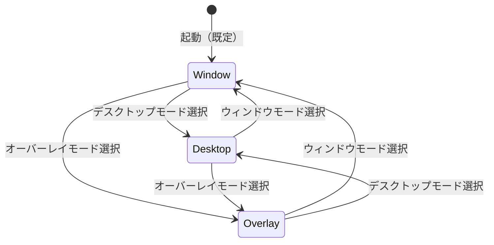

# 12 — 表示モード（Display Modes）

| 項目 | 内容 |
|------|------|
| ステータス | Active |
| 関連 FR | FR-018, FR-019, FR-020, FR-021 |
| プラットフォーム | **Windows 11 以降**（マルチディスプレイ） |

---

## 1. 概要

Petatto-Kanban の UI は **3 種類の表示モード** を提供する。  
いずれも単一ユーザーの独立デスクトップアプリ（`.exe`）上で動作し、カンバン本体（列・カード UI）は共通である。

| モード | ID | 概要 | マイルストーン |
|--------|-----|------|----------------|
| ウィンドウモード | `window` | 通常のウィンドウ表示 | M1（実装済み） |
| デスクトップモード | `desktop` | 指定ディスプレイ全画面・透過・背面 | M2 |
| オーバーレイモード | `overlay` | 指定ディスプレイ全画面・透過・最前面 | M2 |

---

## 2. モード比較

| 属性 | ウィンドウモード | デスクトップモード | オーバーレイモード |
|------|------------------|------------------|-------------------|
| ウィンドウ装飾 | あり（タイトルバー等） | なし（フルスクリーン） | なし（フルスクリーン） |
| 対象ディスプレイ | ユーザーが配置 | **指定ディスプレイ** | **指定ディスプレイ** |
| 表示領域 | リサイズ可能 | ディスプレイ全体 | ディスプレイ全体 |
| 背景透過 | なし（不透明） | **あり** | **あり** |
| 透過時に見えるもの | — | **デスクトップ（壁紙・アイコン）** | **他アプリのウィンドウ** |
| Z オーダー | 通常 | **他ウィンドウの背面** | **最前面（常に上）** |
| 操作対象 | カンバン UI | カンバン UI のみ（背面はクリック透過） | カンバン UI |

### 透過の意味（重要）

| モード | 透過領域の挙動 |
|--------|----------------|
| デスクトップモード | カンバン UI 以外の領域は透明。**デスクトップが見え、他ウィンドウより背面**に固定される |
| オーバーレイモード | カンバン UI 以外の領域は透明。**下にある他ウィンドウが見え、常に最前面**に表示される |

---

## 3. 共通仕様

### DM-COMMON-01: ディスプレイ指定

| 属性 | 値 |
|------|-----|
| 関連 FR | FR-021 |
| 適用 | デスクトップモード、オーバーレイモード |

- ユーザーは **表示先ディスプレイを 1 つ指定** できる
- 選択肢は OS が認識するモニター一覧（例: `ディスプレイ 1`, `ディスプレイ 2`）
- 指定ディスプレイの **作業領域全体** を使用する（タスクバー除外は OS 設定に従う）
- 指定はセッション内で保持し、次回起動時に復元する（[DC-003](./07-data-contract.md#dc-003-表示設定スキーマ)）

### DM-COMMON-02: 透過レンダリング

| 属性 | 値 |
|------|-----|
| 適用 | デスクトップモード、オーバーレイモード |

- **カンバン UI 要素**（列フレーム、カード、ボタン、ヘッダー）は不透明で操作可能
- **それ以外のウィンドウ領域**は完全透過とし、マウスクリックは下層へ透過する（click-through）
- 透過色・レイヤードウィンドウは Windows API で実現（[09-architecture.md §4](./09-architecture.md#4-表示モード実装方針)）

### DM-COMMON-03: モード切替

| 属性 | 値 |
|------|-----|
| 関連 FR | FR-022 |
| 関連 UC | UC-002（ヘッダー） |

- ヘッダーまたは設定 UI から 3 モードを切り替え可能
- 切替時、ボードデータは保持する
- ウィンドウモードへ戻る際、直前のウィンドウサイズ・位置を可能な限り復元する

---

## 4. ウィンドウモード（Window Mode）

### UC-DM-001

| 属性 | 値 |
|------|-----|
| モード ID | `window` |
| 関連 FR | FR-018 |
| ステータス | verified（M1 現行実装） |
| 実装 | `src/petatto_kanban/app.py` |

| 要素 | 仕様 |
|------|------|
| ウィンドウ種別 | 通常の OS ウィンドウ（タイトルバー・枠あり） |
| タイトル | `Petatto-Kanban` |
| 最小サイズ | 960 × 540 px |
| リサイズ | 可能 |
| 背景 | 不透明 |
| Z オーダー | 通常（ユーザーが前面／背面を操作） |
| マルチディスプレイ | ユーザーがウィンドウをドラッグして配置 |

```
┌─ Petatto-Kanban ──────────────────── □ × ┐
│  Header                          [保存]  │
├──────────┬──────────┬────────────────────┤
│  To Do   │ Progress │ Done               │
│  ...     │  ...     │ ...                │
└──────────┴──────────┴────────────────────┘
  ↑ 通常ウィンドウ（不透明・リサイズ可）
```

---

## 5. デスクトップモード（Desktop Mode）

### UC-DM-002

| 属性 | 値 |
|------|-----|
| モード ID | `desktop` |
| 関連 FR | FR-019 |
| ステータス | specified |
| マイルストーン | M2 |

| 要素 | 仕様 |
|------|------|
| 表示領域 | 指定ディスプレイの全画面 |
| ウィンドウ装飾 | なし（`overrideredirect` 等） |
| 背景 | **透過** — デスクトップ（壁紙・アイコン）が見える |
| Z オーダー | **他のすべてのウィンドウより背面** |
| 入力 | カンバン UI 部分のみヒット。透過領域はクリック透過 |
| タスクバー | 背面表示のため、通常どおり他アプリを前面操作可能 |

```
[ ディスプレイ全体 ]
┌─────────────────────────────────────────┐
│ ░░░ デスクトップ壁紙（透過で見える） ░░░ │
│   ┌────────┐                            │
│   │ To Do  │  ← カンバン UI のみ不透明   │
│   │ Card   │                            │
│   └────────┘                            │
│ ░░░░░░░░░░░░░░░░░░░░░░░░░░░░░░░░░░░░░░░ │
└─────────────────────────────────────────┘
  ↑ Excel 等の通常ウィンドウはこの手前に表示される
```

**ユースケース**  
デスクトップに常駐するカンバン付箋のように、作業を妨げず背景に置く。

---

## 6. オーバーレイモード（Overlay Mode）

### UC-DM-003

| 属性 | 値 |
|------|-----|
| モード ID | `overlay` |
| 関連 FR | FR-020 |
| ステータス | specified |
| マイルストーン | M2 |

| 要素 | 仕様 |
|------|------|
| 表示領域 | 指定ディスプレイの全画面 |
| ウィンドウ装飾 | なし |
| 背景 | **透過** — 下にある他アプリのウィンドウが見える |
| Z オーダー | **最前面（Always on Top）** |
| 入力 | カンバン UI 部分のみヒット。透過領域はクリック透過 |
| フォーカス | カンバン操作時のみフォーカス取得。透過領域は下層アプリへ |

```
[ ディスプレイ全体 — 最前面 ]
┌─────────────────────────────────────────┐
│ ░░ 下のウィンドウ（IDE 等）が透過で見える ░│
│      ┌────────────┐                       │
│      │ In Progress│ ← カンバン UI         │
│      │ Card       │                       │
│      └────────────┘                       │
│ ░░░░░░░░░░░░░░░░░░░░░░░░░░░░░░░░░░░░░░░░ │
└─────────────────────────────────────────┘
  ↑ 常に最前面。透過部から下のアプリを操作可能
```

**ユースケース**  
コーディングや資料作成中も、カンバンを常に見える位置に重ねて表示する。

---

## 7. モード切替 UI

### UC-DM-004

| 属性 | 値 |
|------|-----|
| 関連 FR | FR-022 |

| 要素 | 仕様 |
|------|------|
| 配置 | ヘッダー右側（保存・再読み込みの近傍） |
| 形式 | ラジオボタンまたはドロップダウン |
| 選択肢 | `ウィンドウ` / `デスクトップ` / `オーバーレイ` |
| ディスプレイ選択 | デスクトップ・オーバーレイ選択時のみ有効化 |
| 既定値 | `ウィンドウ`（初回起動） |

---

## 8. 状態遷移



| 遷移 | 動作 |
|------|------|
| → Window | 装飾付きウィンドウに復帰。サイズ・位置を復元 |
| → Desktop | 指定ディスプレイ全画面、透過、Z=背面 |
| → Overlay | 指定ディスプレイ全画面、透過、Z=最前面 |

---

## 9. 改訂履歴

| バージョン | 日付 | 変更内容 |
|------------|------|----------|
| 1.0.0 | 2026-08-12 | 3 種類の表示モード仕様を初版定義 |
